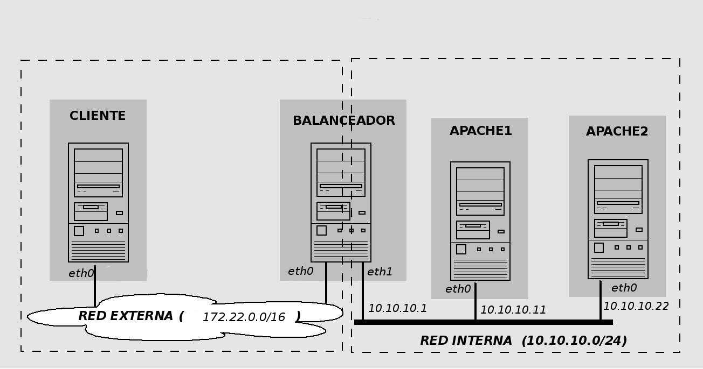
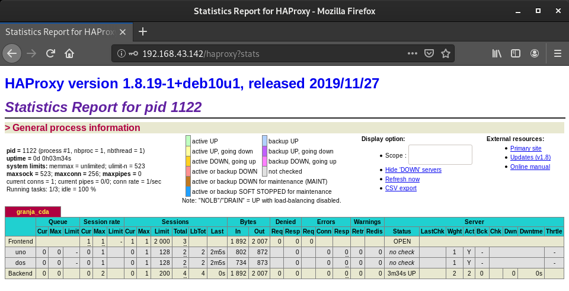
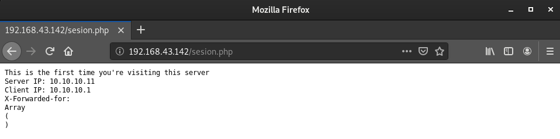
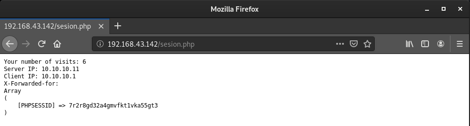
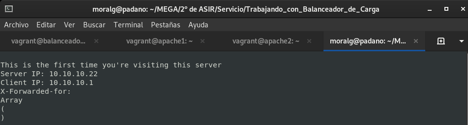

# Balanceador de carga

En esta práctica vamos a hacer uso de vagrant para crear este escenario:

Para ello descarga este [fichero](https://fp.josedomingo.org/serviciosgs/u08/doc/haproxy/vagrant.zip), descomprímelo en un directorio y crea el escenario vagrant.

**Configurar y evaluar balanceo de carga con dos servidores Apache**
Instala HAproxy en balanceador y configuralo de la siguiente manera:

~~~
sudo apt install haproxy
sudo nano /etc/haproxy/haproxy.cfg
~~~

Configuración:
~~~
global
    daemon
    maxconn 256
    user    haproxy
    group   haproxy
    log     127.0.0.1       local0
    log     127.0.0.1       local1  notice
defaults
    mode    http
    log     global
    timeout connect 5000ms
    timeout client  50000ms
    timeout server  50000ms
listen granja_cda
    bind 172.22.x.x:80 #aquí pon la dirección ip del balanceador
    mode http
    stats enable
    stats auth  cda:cda
    balance roundrobin
    server uno 10.10.10.11:80 maxconn 128
    server dos 10.10.10.22:80 maxconn 128
~~~

Define (en la sección `listen`) un “proxy inverso” de nombre `granja_cda` que:

* trabajará en modo `http` (la otra alternativa es el modo tcp, pero no analiza las peticiones/respuestas HTTP, sólo retransmite paquetes TCP)
* atendiendo peticiones en el puerto 80 del balanceador
* con balanceo `round-robin`
* que repartirá las peticiones entre dos servidores reales (de nombres uno y dos) en el puerto 80 de las direcciones 10.10.10.11 y 10.10.10.22
* adicionalmente, habilita la consola Web de estadísticas, accesible con las credenciales `cda:cda`

Más detalles en [Opciones de configuración HAPproxy 1.8.](https://cbonte.github.io/haproxy-dconv/1.8/configuration.html)

Inicia HAproxy en balanceador: Antes de hacerlo es necesario habilitar en `/etc/default/haproxy` el arranque de HAproxy desde los scripts de inicio, estableciendo la variable `ENABLED=1`

Reiniciamos el servicio:
~~~
sudo systemctl restart haproxy.service 
~~~

Por último, desde la máquina cliente abrir en un navegador web la URL `http://172.22.x.x` y recargar varias veces para comprobar como cambia el servidor real que responde las peticiones.

## Tarea 1

Entrega capturas de pantalla que el balanceador está funcionando.

Vamos recargando la página y nos irá cambiando de nodo.

## Tarea 2

Entrega una captura de pantalla donde se vea la página web de estadísticas de haproxy (abrir en un navegador web la URL http://172.22.x.x/haproxy?stats, pedirá un usuario y un password, ambos cda).

## Tarea 3

Desde uno de los servidores (apache1 ó apache2), verificar los logs del servidor Apache. En todos los casos debería figurar como única dirección IP cliente la IP interna de la máquina balanceador 10.10.10.1. ¿Por qué?

Vamos a verificar los log de apache1 y veremos que solamente utiliza la ip interna del balanceador.

~~~
sudo tail /var/log/apache2/access.log
    10.10.10.1 - - [21/Feb/2020:20:20:21 +0000] "GET / HTTP/1.1" 200 436 "-" "Mozilla/5.0 (X11; Linux x86_64; rv:68.0) Gecko/20100101 Firefox/68.0"
    10.10.10.1 - - [21/Feb/2020:20:21:09 +0000] "GET / HTTP/1.1" 200 436 "-" "Mozilla/5.0 (X11; Linux x86_64; rv:68.0) Gecko/20100101 Firefox/68.0"
    10.10.10.1 - - [21/Feb/2020:20:23:14 +0000] "GET /favicon.ico HTTP/1.1" 404 437 "-" "Mozilla/5.0 (X11; Linux x86_64; rv:68.0) Gecko/20100101 Firefox/68.0"
~~~

Esto es porque el balanceador es el que le proporciona la dirección ip.

## Tarea 4

Verificar la estructura y valores de las cookies PHPSESSID intercambiadas. En la primera respuesta HTTP (inicio de sesión), se establece su valor con un parámetro HTTP SetCookie en la cabecera de la respuesta. Las sucesivas peticiones del cliente incluyen el valor de esa cookie (parámetro HTTP Cookie en la cabecera de las peticiones).

**Configurar la persistencia de conexiones Web (sticky sessions)**

En los servidores internos hay una aplicación PHP para trabajar con sesiones, puedes encontrar el fichero `sesion.php` con el siguiente contenido:

~~~
<?php
     header('Content-Type: text/plain');
     session_start();
     if(!isset($_SESSION['visit']))
     {
             echo "This is the first time you're visiting this server";
             $_SESSION['visit'] = 0;
     }
     else
             echo "Your number of visits: ".$_SESSION['visit'];

     $_SESSION['visit']++;

     echo "\nServer IP: ".$_SERVER['SERVER_ADDR'];
     echo "\nClient IP: ".$_SERVER['REMOTE_ADDR'];
     echo "\nX-Forwarded-for: ".$_SERVER['HTTP_X_FORWARDED_FOR']."\n";
     print_r($_COOKIE);
?>
~~~

Vamos a añadir las opciones de persistencia de conexiones HTTP (sticky cookies) al fichero de configuración `/etc/haproxy/haproxy.cfg`:

Contenido a incluir: (añadidos marcados con <- aquí)::

~~~
global
     daemon
     maxconn 256
     user    haproxy
     group   haproxy
     log     127.0.0.1       local0
     log     127.0.0.1       local1  notice

 defaults
     mode    http
     log     global
     timeout connect 10000ms
     timeout client  50000ms
     timeout server  50000ms

 listen granja_cda 
     bind 172.22.x.x:80 #aquí pon la dirección ip del balanceador
     mode http
     stats enable
     stats auth  cda:cda
     balance roundrobin
     cookie PHPSESSID prefix                               # <- aquí
     server uno 10.10.10.11:80 cookie EL_UNO maxconn 128   # <- aquí
     server dos 10.10.10.22:80 cookie EL_DOS maxconn 128   # <- aquí
~~~

El parámetro cookie especifica el nombre de la cookie que se usa como identificador único de la sesión del cliente (en el caso de aplicaciones web PHP se suele utilizar por defecto el nombre PHPSESSID). Para cada “servidor real” se especifica una etiqueta identificativa exclusiva mediante el parámetro cookie. Con esa información HAproxy reescribirá las cabeceras HTTP de peticiones y respuestas para seguir la pista de las sesiones establecidas en cada “servidor real” usando el nombre de cookie especificado (PHPSESSID):

* conexión cliente -> balanceador HAproxy : cookie original + etiqueta de servidor
* conexión balanceador HAproxy -> servidor : cookie original

Reiniciamos el servicio:
~~~
sudo systemctl restart haproxy.service 
~~~

Realizamos las siguientes acciones:

* desde el navegador web acceder varias veces a la URL `http://172.22.x.x/sesion.php` (comprobar el incremento del contador [variable de sesión])

Aumento al actualizar la página:

* acceder la misma URL desde el navegador en modo texto lynx (o desde una pestaña de “incógnito” del Navegador para forzar la creación de una nueva sesión):

~~~
  cliente:~# lynx -accept-all-cookies http://172.22.x.x/sesion.php
~~~

